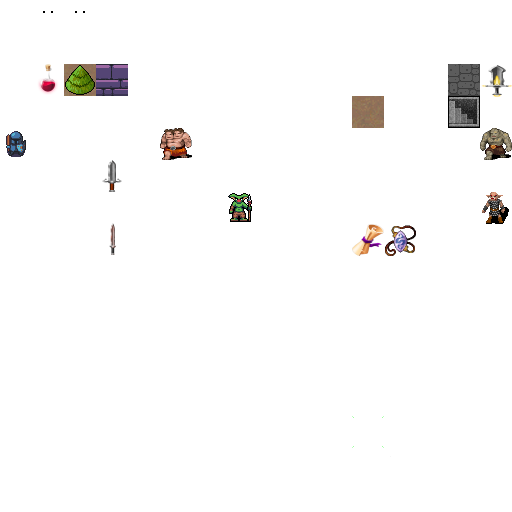

# Building A Dungeon Crawler

- Project Name: Rusty Roguelike
- Short Description:
  A dungeon crawler with procedurally generated levels, monsters of increasing difficulty, and turn-based movement.
- Story
- Basic Game Loop
  - Enter dungeon level
  - Explore, revealing the map
  - Encounter enemies whom the player fights or flees from.
  - Find power-ups and use them to strengthen the player
  - Locate the exit to the level - go to 1
- Minimum Viable Product
  - Create a basic dungeon map
  - Place the player and let them walk around
  - Spawn monsters, draw them, and let the player kill them by walking into them.
  - Add health and a combat system that uses it.
  - Add healing potions
  - Display a "game over" screen when the player dies.
  - Add the Amulet of Yala to the level and let the player win by reaching it.
- Stretch Goals
  - Add Fields-of-View
  - Add more interesting dungeon designs
  - Add some dungeon themes
  - Add multiple levels of dungeon, with the Amulet on the last one,
  - Add varied weapons to the game
  - Move to a data-driven design for spawning enemies
  - Consider some visual effects to make combat more visceral
  - Consider keeping score


## Dividing Your Code Into Modules
- Easy to find the code
- Cargo can compile modules concurrently, leading to much better compilation performance
- Bugs are easier to find in self-contained code

### Crates and Modules

- `Crates`: Large groups of code with their own `Cargo.toml` file.

Crates and modules act as `namespace`, `bracket-lib::prelude` refers to the `bracket-lib` crate's `prelude` module.
Use can reference the current crate with `crate::`, for example, `map` module could be referred with `crate::map` in the same crate.

### Make a Stub Map Module

```yaml
# dependency on bracket-lib, newer than 0.8.1
[dependencies]
bracket-lib = "~0.8.1"
```

The below code imports `map` module into the global scope and sets up the `map::` prefix.
```rust
// in main.rs
mod map;
map::my_func;

// or
use map::my_func;
my_func;
```

### Module Scoping

- Modules are self-contained and have their own scope
- By default, everything in the module is private to the module.
- Making module entries `public` with the `pub` keyword:
  - Functions (e.g. `pub fn my_function()`)
  - Structs (e.g. `pub struct MyStruct`)
  - Enumerations (e.g. `pub enum MyEnum`)
  - Implemented functions (e.g. `impl MyStruct { pub fn my_function() }`)


## Organizing Your Imports With a Prelude
Prefixing every map access with `map::` or `crate::map::` is unwieldy and will get more cumbersome as you add more modules.
It's common for the library author to have placed everything you need in a convenient `prelude`.

```rust
// add the module to project with mod
mod map;


mod prelude {
// Publicly using the bracket_lib prelude re-exports it inside your prelude.
// pub to makes them public
  pub use bracket_lib::prelude::*;
// Make the declaring available to any section of code that uses your prelude.
  pub const SCREEN_WIDTH: i32 = 80;
  pub const SCREEN_HEIGHT: i32 = 50;
// Re-export the map as a public module available from within your prelude.
  pub use create::map::*;
}

use prelude::*;
```

### Set Up Your Map Module

```rust
use crate::prelude::*;
const NUM_TILES: usize = (SCREEN_WIDTH * SCREEN_HEIGHT) as usize;
```

## Storing the Dungeon Map
Most two-dimensional games represent their map as a series of tiles in a grid pattern. Each tile has a type describing how that tile is rendered—and what happens if you try to enter it.

### Represent Your Tiles
Tiles are limited to a pre-defined set of tile types, making them perfect for an enum.

```rust
#[derive(Copy, Clone, PartialEq)]
pub enum TileType {
  Wall,
  Floor,
}
```

- `Copy`
  `Copy` changes the default action then assigning a `TileType` from one variable to another.
  Instead of moving the value, it makes a copy. Clippy will warn you if you are borrowing a variable and it would be faster to copy it.

- `Clone`
  `Clone` adds a clone function to the type, Calling `mytile.clone` makes a deep copy of the variable without affecting the original.

- `PartialEq`
  `PartialEq` adds code that allows you to compare `TileType` with "==" operator.

### Create an Empty Map

```rust
pub struct Map {
  pub tiles: Vec<TileType>,
}

impl Map {
  // construction function
  pub fn new() -> Self {
    Self {
      tiles: vec![TileType::Floor; NUM_TILES],
    }
  }
}
```

### Index the Map
Vectors are indexed on a single dimension, you need to transform map location (x,y) into vector indices. The transformation is known as `striding`.

```rust
pub fn map_idx(x: i32, y: i32) -> usize {
  ((y * SCREEN_WIDTH) + x) as usize
}

x = idx % SCREEN_WIDTH;
y = idx / SCREEN_WIDTH;
```

### Render the Map
```rust
  pub fn render(&self, ctx: &mut BTerm) {
    for y in 0..SCREEN_HEIGHT {
      for x in 0..SCREEN_WIDTH {
        let idx = map_idx(x, y);
         match self.tiles[idx] {
           TileType::Wall => {
             ctx.set(x, y, YELLOW, BLACK, to_cp437('.'));
           }
           TileType::Floor => {
            ctx.set(x, y, GREEN, BLACK, to_cp437('#'));
           }
         }
      }
    }
  }
```

### Consume the Map API
```rust
impl GameState for State {
  fn tick(&mut self, ctx: &mut BTerm) {
    ctx.cls();
    self.map.render(ctx);
  }
}

fn main() -> BError {
  let context = BTermBuilder::simple80x50()
    .with_title("Dungeon Crawler")
    .with_fps_cap(30.0)
    .build()?;
  
  main_loop(context, State::new())
}
```

## Adding the Adventurer
The adventurer is the player's avatar in the dungeon.

### Extend the Map API
Determining if an x/y coordinate pair is within the bounds of the map.
```rust
  // reference will not take over ownership
  // The sample is using moving, not sure whether is a clone.
  pub fn in_bounds(&self, point: &Point) -> bool {
    point.x >= 0 && point.x < SCREEN_WIDTH &&
    point.y >= 0 && point.y < SCREEN_HEIGHT
  }
```

Determining if the player can enter a tile.
```rust
  pub fn can_enter_tile(&self, point: &Point) -> bool {
    self.in_bounds(point) &&
    self.tiles[map_idx(point.x, point.y)] == TileType::Floor
  }
```

It would be useful to have a means of determining a tile’s index coordinates, and indicate an error condition if the requested coordinates fall outside of the map boundaries.
```rust
  // Option
  // enum Option<T> {
  //   None,
  //   Some(T),
  //  }
  // To represent none concept
  pub fn try_idx(&self, point: &Point) -> Option<usize> {
    if !self.in_bounds(point) {
      None
    } else {
      Some(map_idx(point.x, point.y))
    }
  }
```

### Create the Player Structure

Create a new `player.rs`, add it into crate prelude.
```rust
mod map;
mod player;

mod prelude {
  pub use bracket_lib::prelude::*;
  pub const SCREEN_WIDTH: i32 = 80;
  pub const SCREEN_HEIGHT: i32 = 50;
  pub use crate::map::*;
  pub use crate::player::*;
}
```

Defining the structure of the Player.
```rust
// pub to be available
pub struct Player {
  // pub to be available
  pub position: Point,
}

impl Player {
  pub fn new(position: Point) -> Self {
    Self {
      position
    }
  }
}
```

### Render the Player
```rust
  pub fn render(&self, ctx: &mut BTerm) {
    ctx.set(
      self.position.x,
      self.position.y,
      WHITE,
      BLACK,
      to_cp437('@'),
    );
  }
```

### Move the Player
```rust
  pub fn update(&mut self, ctx: &mut BTerm, map: &Map) {
    // The below match could be awkward like this, "if let" make it clearer
    // let x = Some(7)
    // match x {
    // }
    // The `if let` construct reads: "if `let` destructures `key` into `Some(i)`, evaluate the block (`{}`)"
    if let Some(key) = ctx.key {
      let delta = match key {
        VirtualKeyCode::Left => Point::new(-1, 0),
        VirtualKeyCode::Right => Point::new(1, 0),
        VirtualKeyCode::Up => Point::new(0, -1),
        VirtualKeyCode::Down => Point::new(0, 1),
        _ => Point::zero(),
      };

      let new_position = self.position + delta;
      if map.can_enter_tile(&new_position) {
        self.position = new_position;
      }
    }
```

### Consume the Player API
```rust
struct State {
  map: Map,
  player: Player,
}

impl State {
  fn new() -> Self {
    Self { 
      map: Map::new(),
      player: Player::new(Point::new(SCREEN_WIDTH/2, SCREEN_HEIGHT/2)),
    }
  }
}

impl GameState for State {
  fn tick(&mut self, ctx: &mut BTerm) {
    ctx.cls();
    self.player.update(ctx, &self.map);
    self.map.render(ctx);
    self.player.render(ctx);
  }
}

fn main() -> BError {
  let context = BTermBuilder::simple80x50()
    .with_title("Dungeon Crawler")
    .with_fps_cap(30.0)
    .build()?;
  
  main_loop(context, State::new())
}
```

# Building a Dungeon
# Graphics, Camera, Action
## Programmer Art for the Dungeon
`bracket-lib` renders terminals by copying glyphs from a font file onto the terminal window, users could assign a symbol to a tile type and replacing that character in the font file with chosen programmer art.

Here use the `resources/dungeonfont.png`:


## Graphics Layers
You can get much better results by using `layers`. The map is rendered to a base layer, and the player to the layer on top of it—with transparency, so the floor remains visible. 
```rust
let context = BTermBuilder::new()
    .with_title("Dungeon Crawler")
    .with_fps_cap(30.0)
    // The size of subsequent consoles you add
    .with_dimensions(DISPLAY_WIDTH, DISPLAY_HEIGHT)
    // The size of each character in the fond file
    .with_tile_dimensions(32, 32)
    // The root path of font file
    .with_resource_path("resources/")
    // the font file and the character dimensions
    .with_font("dungeonfont.png", 32 ,32)
    // Add a console using the dimensions and the named tile graphics file
    .with_simple_console(DISPLAY_WIDTH, DISPLAY_HEIGHT, "dungeonfont.png")
    // Add a second console with no background so transparency shows through it.
    .with_simple_console_no_bg(DISPLAY_WIDTH, DISPLAY_HEIGHT, "dungeonfont.png")
    .build()?;
```

## Make a Camera
```rust
// Camera Struct
pub struct Camera {
  pub left_x: i32,
  pub right_x: i32,
  pub top_y: i32,
  pub bottom_y: i32,
}
```

We need a construction function and the camera needs to follow the player's location after the player moved.
```rust
impl Camera {
  pub fn new(player_point: Point) -> Self {
    Self {
      // center is the player
      left_x: player_point.x - DISPLAY_WIDTH/2,
      right_x: player_point.x + DISPLAY_WIDTH/2,
      top_y: player_point.y - DISPLAY_HEIGHT/2,
      bottom_y: player_point.y + DISPLAY_HEIGHT/2
    }
  }

  pub fn on_player_move(&mut self, player_point: Point) {
    self.left_x = player_point.x - DISPLAY_WIDTH/2;
    self.right_x = player_point.x + DISPLAY_WIDTH/2;
    self.top_y = player_point.y - DISPLAY_HEIGHT/2;
    self.bottom_y = player_point.y + DISPLAY_HEIGHT/2;
  }
}
```

The map should be rendered with the camera window range, update the `render` of map as:
```rust
  pub fn render(&self, ctx: &mut BTerm, camera: &Camera) {
    // activate map layer
    ctx.set_active_console(0);

    for y in camera.top_y..camera.bottom_y {
      for x in camera.left_x..camera.right_x {
        if self.in_bounds(&Point::new(x, y)) {
          let idx = map_idx(x, y);
          match self.tiles[idx] {
            TileType::Floor => {
              ctx.set(x-camera.left_x, y-camera.top_y, WHITE, BLACK, to_cp437('.'));
            }
            TileType::Wall => {
              ctx.set(x-camera.left_x, y-camera.top_y, WHITE, BLACK, to_cp437('#'));
            }
          }
        }
      }
    }
  }
```

Also we need to connect the player and the camera
```rust
// update function, update camera when the position changes
      let new_position = self.position + delta;
      if map.can_enter_tile(&new_position) {
        self.position = new_position;
        camera.on_player_move(new_position);
      }
```

Rendering the player on player layer according to the camera location.
```rust
  pub fn render(&self, ctx: &mut BTerm, camera: &Camera) {
    ctx.set_active_console(1);
    ctx.set(
      self.position.x - camera.left_x,
      self.position.y - camera.top_y,
      WHITE,
      BLACK,
      to_cp437('@'),
    );
  }
```

In main loop, we need to clear all layers and update functions
```rust
// main.rs
impl GameState for State {
  fn tick(&mut self, ctx: &mut BTerm) {
    ctx.set_active_console(0);
    ctx.cls();
    ctx.set_active_console(1);
    ctx.cls();
    self.player.update(ctx, &self.map, &mut self.camera);
    self.map.render(ctx, &self.camera);
    self.player.render(ctx, &self.camera);
  }
}
```