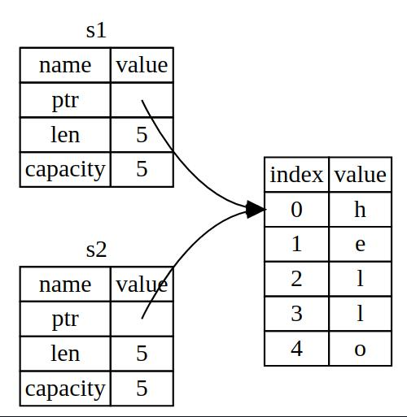

# 3. OwnerShip

## 3.1. What's OwnerShip

### 3.1.1. The Stack and the Heap
Keeping track of what parts of code are using what data on the heap, minimizing the amount of duplicate data on the heap, and cleaning up unused data on the heap so you don’t run out of space are all problems that ownership addresses. 

### 3.1.2. Ownership Rules
- Each value in Rust has a variable that's called its `owner`.
- There can only be one owner at a time
- When the owner goes out of the scope, the value will be `dropped`

```rust
  {
    // s is not valid here, it's not yet declared
    let s = "hello"; // s is valid from here
    // do the staff with s
    println!("s = {}", s);
  } // the scope is over, s is no longer valid
  println!("s = {}", s);

//error[E0425]: cannot find value `s` in this scope
//  --> src/main.rs:8:22
//   |
// 8 |   println!("s = {}", s);
//   |                      ^ not found in this scope

// For more information about this error, try `rustc --explain E0425`.
```

### 3.1.3. String Type
```rust
  let mut s = String::from("hello");
  s.push_str(", world!");
  println!("s = {}", s);
```

### 3.1.4. Memory and Allocation

When a variable goes out of scope, Rust calls a special function for us. This function is called `drop`, and it’s where `the author of String` can put the code to return the memory. Rust calls drop automatically at the closing curly bracket.

### 3.1.5. Ways Variables and Data Interact: Move

- Scalar

Scalar has a known, fixed-size, which is pushed into stack, so we could have 2 variables `x` and `x1` that binds to `5`
```rust
  let x = 5;
  let x1 = x;
  println!("x = {}, x1 = {}", x, x1);
```

- String

The pattern of `String` is not all the same as previous, only pointer copying was done on this.



Both of `s` and `s1` points to the same memory space on heap, so there will be `double free` bug when doing `drop` for `s` and `s1`.
So Rust make `s` invalid, it is called as `s` is moved to `s1`.

```rust
  // String
  {
    let s = "hello";
    let s1 = s;
    println!("s = {}, s1 = {}", s, s1);
  }
// error[E0425]: cannot find value `s1` in this scope
//   --> src/main.rs:29:14
//    |
// 29 |     let s1 = s1;
//    |              ^^ help: a local variable with a similar name exists: `s`

// For more information about this error, try `rustc --explain E0425`.
// error: could not compile `ownership` due to previous error
```

It looks like `shallow copy` if you've heard of this, but rust also `invalidates` the first variable, it is called as `move`.


### 3.1.5. Ways Variables and Data Interact: Clone
If we want to do a deeply copy of the heap data of the `String`, we could use a common method called `clone`.

```rust
  // clone
  {
    let s = String::from("hello");
    let s1 = s.clone();
    println!("s = {}, s1 = {}", s, s1);
  }
```

- Stack-Only Data: Copy

For such data type which we've known the data size at compiling time, the copies are very easy to be made. There was no difference between `deep copy` and `shallow copy`, **so we don't need to do `clone` for such kind of data.**

Rust has a special annotation called `Copy` trait that we can place on the types like integers that are stored on the stack. If a type implements the `Copy` trait, an older variable is still usable after assignment. But there is constrains on implementing for a specific type.

As a general rule, any group of simple scalar values can implement `Copy`, and nothing that requires allocation or is some form of resource can implement `Copy`:
- All the integer types, such as `u32`
- The Boolean type, bool, with values true and false.
- All the floating point types, such as `f64`.
- The character type, `char`.
- Tuples, if they only contain types that also implement Copy. For example, `(i32, i32)` implements Copy, but `(i32, String)` does not.

### 3.1.6 Ownership and Functions


- Passing Variables

Passing a variable to a function will `move` or `copy`.
```rust
  {
    let s = String::from("hello");
    takes_ownership(s);               // make move, taken the ownership of s
    // println!("s = {}", s);         // s' ownership is transferred to takes_ownership, invalidate here.

    let x = 5;
    make_copy(x);                     // make copy here of x
    println!("x = {}", x);            // x is valid here
  }
```

- Return Values and Scope
```rust
  // functions return values
  {
    let s = gives_ownership();
    println!("s = {}", s);

    let s = takes_and_give_back(s);
    println!("s = {}", s);
  }
  fn gives_ownership() -> String {
    let s = String::from("gives_ownership");
    s
  }
  fn takes_and_give_back(s: String) -> String {
    println!("got s = {}", s);
    s
  }
```

# 3.2. Reference and Borrowing

- Concept
  - We could use `&` to refer to some value but not take the ownership of it, it is called `reference`.
  - We call having reference as function parameters as `borrowing`.

- We could use the borrowed variable and don't need to returns the ownership, cause the ownership hasn't been transferred.
```rust
  {
    let s = String::from("reference");
    let len = cal_string_len(&s);
    println!("s {} len is {}", s, len);
  }
  fn cal_string_len(s: &String) -> usize {
    s.len()
  }
```

- we could use the borrowed variable but could not modify it when it is immutable.
```rust
  {
    let s = String::from("reference");
    change_str(&s);
  }
  fn change_str(s: &String) {
    s.push_str(", added.");
  }
// error[E0596]: cannot borrow `*s` as mutable, as it is behind a `&` reference
//   --> src/main.rs:77:3
//    |
// 76 | fn change_str(s: &String) {
//    |                  ------- help: consider changing this to be a mutable reference: `&mut String`
// 77 |   s.push_str(", added.");
//    |   ^ `s` is a `&` reference, so the data it refers to cannot be borrowed as mutable
```

- We could use the borrowed variable and modify it with `mutable reference`
```rust
  {
    let mut s = String::from("reference");
    change_str(&mut s);
    println!("s = {}", s);
  }
  fn change_str(s: &mut String) {
    s.push_str(", added.");
  }
```

- `mutable reference` could only be done once for a particular piece of data.
  
  The benefit of having this restriction is that Rust can prevent data races at compile time. A data race is similar to a race condition and happens when these three behaviors occur:
  - All Two or more pointers access the same data at the same time.
  - We At least one of the pointers is being used to write to the data.
  - There’s no mechanism being used to synchronize access to the data.
```rust
  {
    let mut s = String::from("reference");
    let r1 = &mut s;
    let r2 = &mut s;
    println!("r1 = {}, r2 = {}", r1, r2);
  }
// error[E0499]: cannot borrow `s` as mutable more than once at a time
//   --> src/main.rs:77:14
//    |
// 76 |     let r1 = &mut s;
//    |              ------ first mutable borrow occurs here
// 77 |     let r2 = &mut s;
//    |              ^^^^^^ second mutable borrow occurs here
// 78 |     println!("r1 = {}, r2 = {}", r1, r2);
//    |                                  -- first borrow later used here
```

- rust doesn't allow to have `Dangling References`
```rust
  {
    let r = dangle();
  }

  fn dangle() -> &String {
    let s = String::from("dangle");
    &s
  }
// error[E0106]: missing lifetime specifier
//   --> src/main.rs:86:16
//    |
// 86 | fn dangle() -> &String {
//    |                ^ expected named lifetime parameter
//    |
//    = help: this function's return type contains a borrowed value, but there is no value for it to be borrowed from
// help: consider using the `'static` lifetime
//    |
// 86 | fn dangle() -> &'static String {
//    |                ^^^^^^^^
```

## 3.2. Slice Type
Another type that has no ownership is `slice`
### 3.2.1. String Slice

```rust
let slice = &s[0..i];
let slice = &s[..i];
let slice = &s[i..];
let slice = &s[..];
```

```rust
{
  let s = String::from("hello world");
  let word = first_word(&s);
  // s.clear();
  println!("s = {}", s);
  println!("the first word is {}", word);

}

fn first_word(s: &String) -> &str {
  let bytes = s.as_bytes();

  for (i, &item) in bytes.iter().enumerate() {
    if b' ' == item {
      return &s[..i];
    }
  }

  &s[..]
}
```

### 3.2.2. String Literals Are Slices

```rust
let s = "Hello, World!"
```
The type of `s` is `&str`, which is immutable, so string literals are immutable.

### 3.2.3. String Slices as Parameters
By making the parameter as `&str`, we could pass `String` or `str` into the function.
```rust
{
  let s = String::from("hello world");
  let word = first_word(&s);
  // s.clear();
  println!("the first word is {}", word);

  let s1 = "hello world";
  let word1 = first_word(&s1);
  println!("the first word is {}", word1);

}

fn first_word(s: &str) -> &str {
  let bytes = s.as_bytes();

  for (i, &item) in bytes.iter().enumerate() {
    if b' ' == item {
      return &s[..i];
    }
  }

  &s[..]
}
```
